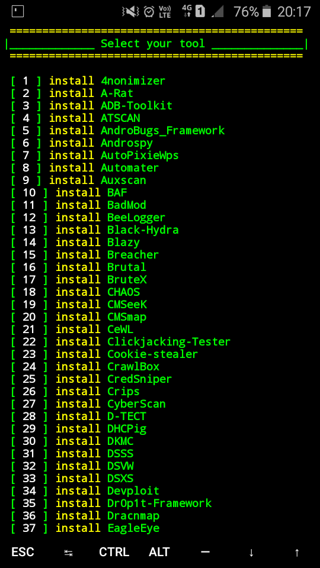

# Tool-X

[](https://github.com/Error-4-You/Tool-X)
[](https://github.com/Error-4-You/Tool-X)
[](https://github.com/Error-4-You/Tool-X)

------------------------------------------------------------------------

                 
  
## LICENSE:
This software is free to distribute, modify and use with the condition that credit is provided to the creator (Error-4-You) and is not for commercial use.


### Introduction

*Tool-X is a Kali Linux hacking tools installer for Termux and linux system.*
Tool-X was developed for Termux and linux based systems. Using Tool-X, you can install almost 370+ hacking tools in Termux (android) and other Linux based distributions. Now Tool-X is available for Ubuntu, Debian etc.

*A similar lightweight and fast tool [onex](https://github.com/Error-4-You/onex) is available. We can use onex instead of Tool-X*

<br>
<p align="center">



</p>

------------------------------------------------------------------------

### Operating System Requirements

Tool-X works on any of the following operating systems:<br>
• **Android** (Using the Termux App) <br>
• **Linux** (Debian Based Systems) <br>
• **Unix**

------------------------------------------------------------------------

### How to Install

Open the terminal and type following commands.

* ```apt update```

* ```apt install git```

* ```git clone https://github.com/Error-4-You/Tool-X.git```

* ```cd Tool-X```

* ```chmod +x install```

* ```sh install``` if not work than use ```./install```

------------------------------------------------------------------------

### How to Use ?

Enter a Number for a specific output:
- (1) : To show all available tools and type the number of a tool which you want to install.
- (2) : To show tools category.
- (3) : If you want to update Tool-X.
- (4) : If you want to know About Us.
- (x) : To exit the tool.

<br/>

Type ```Tool-X``` or ```toolx``` from anywhere in your terminal to open Tool-X.

------------------------------------------------------------------------

### How to remove ?

Open Tool-X and type ```rm -T` or `uninstall tool-x``` to uninstall Tool-X.

------------------------------------------------------------------------

 <p align="center">
<a href="https://github.com/Error-4-You"></a>
<a href="https://youtube.com/channel/UCfjJgu6-VQPvcgRaygLyhqQ"></a>
</p>

<p align="center">
<a href="https://t.me/h4ck199"></a>
<a href="https://chat.whatsapp.com/FkcQ98SucwgK1TbTfGWzsR"></a>

<a href="https://chat.whatsapp.com/FkcQ98SucwgK1TbTfGWzsR"></a>
</p>

**Warning**

<p>We are not responsible for any misuse or damage caused by this program. use this tool at your own risk!<p>

<p>This tool is only for educational purpose. If you use this tool for other purposes except education we will not be responsible in such cases.</p>

 2022 © - Error-4-You

